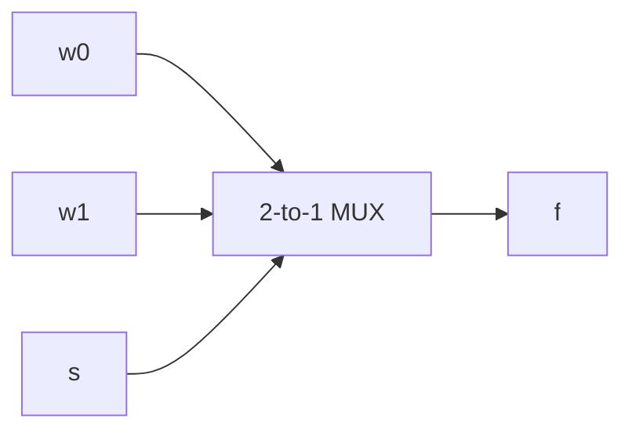
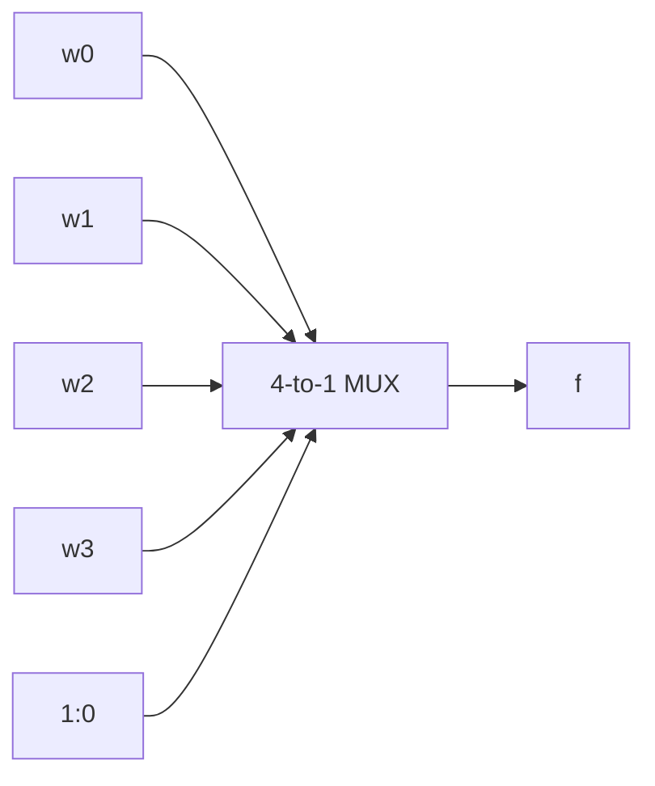
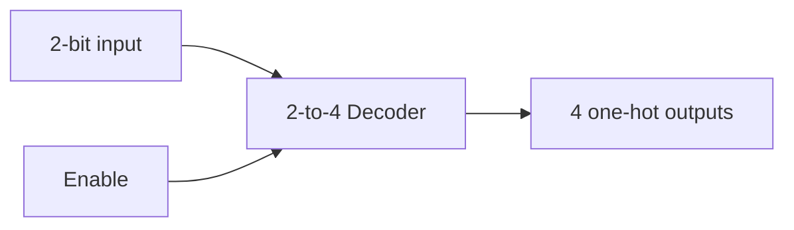

# VHDL 1-4 Study Guide

## 1. The big picture

VHDL is a hardware description language used to:

- document a digital circuit;
- simulate its behavior; and
- synthesize code into hardware.

### The basic VHDL model

Memorize:

> **Library/packages -> Entity -> Architecture -> Hardware behavior**

```vhdl
LIBRARY ieee;
USE ieee.std_logic_1164.all;

ENTITY circuit_name IS
    PORT (
        a : IN  STD_LOGIC;
        y : OUT STD_LOGIC
    );
END circuit_name;

ARCHITECTURE Behavior OF circuit_name IS
    -- internal SIGNAL declarations go here
BEGIN
    -- concurrent assignments, component instances, or processes go here
END Behavior;
```

### Entity versus architecture

| Part | What it describes | Memory cue |
|---|---|---|
| `ENTITY` | External interface: ports, directions, and types | What the outside world sees |
| `ARCHITECTURE` | Internal implementation and behavior | How the circuit works |
| `SIGNAL` | Internal connection/wire | A named wire inside the design |
| `PROCESS` | Sequential-looking statements triggered by signals | A behavior block |
| `COMPONENT` | A reusable circuit block | A Lego piece |

VHDL is case-insensitive. Comments begin with `--`.

## 2. Ports, types, and vectors

### Port modes

| Mode | Meaning |
|---|---|
| `IN` | Can be read by the architecture; input only |
| `OUT` | Can be driven by the architecture; output |
| `BUFFER` | Output that can also be read internally |
| `INOUT` | Bidirectional port |

### Important types

- `BIT`: only `'0'` and `'1'`.
- `BIT_VECTOR`: an array of `BIT` values.
- `STD_LOGIC`: a nine-value logic type.
- `STD_LOGIC_VECTOR`: an array of `STD_LOGIC` values.
- `BOOLEAN`: `TRUE` or `FALSE`.
- `INTEGER`: integer values, optionally with a range.

`STD_LOGIC` values to recognize:

| Value | Meaning |
|---|---|
| `'0'`, `'1'` | Logic zero, logic one |
| `'Z'` | High impedance |
| `'-'` | Don't care |
| `'U'` | Uninitialized |
| `'X'` | Unknown |
| `'W'` | Weak unknown |
| `'L'`, `'H'` | Weak zero, weak one |

### Vector indexing

Always check the declared range and direction.

```vhdl
STD_LOGIC_VECTOR(3 DOWNTO 0) -- commonly written w(3), w(2), w(1), w(0)
STD_LOGIC_VECTOR(0 TO 3)     -- commonly written y(0), y(1), y(2), y(3)
```

The left-to-right string position follows the declared vector range. Do not assume every vector is indexed the same way.

Concatenation uses `&`:

```vhdl
Enw <= En & w;
```

If `En = '1'` and `w = "10"`, then `Enw = "110"`.

## 3. Operators and precedence

Logical operators include `NOT`, `AND`, `OR`, `NAND`, `NOR`, `XOR`, and `XNOR`.

From highest to lowest precedence in the source material:

1. `NOT`
2. `*`, `/`
3. `+`, `-`, `&`
4. shifts and rotates
5. relational operators: `=`, `/=`, `<`, `>`, `<=`, `>=`
6. logical operators

All logical operators have the same precedence, so parenthesize SOP expressions:

```vhdl
f <= (x1 AND x2) OR (x3 AND x4);
```

## 4. Three ways to describe combinational logic

### A. Direct concurrent assignment

```vhdl
f <= (a AND b) OR c;
```

This represents hardware directly. Concurrent statements operate in parallel and may be written in any order.

### B. Selective assignment: `WITH ... SELECT`

Use this when one signal selects among several alternatives.

```vhdl
WITH s SELECT
    f <= w0 WHEN "00",
         w1 WHEN "01",
         w2 WHEN "10",
         w3 WHEN OTHERS;
```

Memorize:

> **WITH asks: “What is the selector value?”**

`when others` is required when not every possible selector value is explicitly covered.

### C. Conditional assignment: `WHEN ... ELSE`

```vhdl
f <= w0 WHEN s = '0' ELSE
     w1;
```

Memorize:

> **WHEN-ELSE asks: “Which condition is true?”**

The final `else` covers all remaining cases.

## 5. Processes and IF statements

A process is a concurrent statement, but statements inside it execute top-to-bottom.

```vhdl
PROCESS (w0, w1, s)
BEGIN
    IF s = '0' THEN
        f <= w0;
    ELSE
        f <= w1;
    END IF;
END PROCESS;
```

### Sensitivity list

The sensitivity list contains signals that can cause the process to run. For combinational logic, include every input read by the process.

```vhdl
PROCESS (a, b, sel)
```

If an input is omitted, simulation may fail to update when that input changes.

### Sequential statements

`IF`, `CASE`, `FOR LOOP`, `WHILE LOOP`, and `WAIT` belong inside a process.

Important process rules:

- Statements inside a process execute sequentially.
- Signal assignments normally take effect after the process finishes.
- If a signal is assigned multiple times in one process activation, the last assignment wins.
- In an `IF ... ELSIF ... ELSE` chain, the first true branch wins. This creates priority.

## 6. Digital logic topologies to memorize

### 6.1 2-to-1 multiplexer

Function:

```text
s = 0 -> f = w0
s = 1 -> f = w1
```

Equation:

```text
f = (NOT s AND w0) OR (s AND w1)
```



Truth table:

| `s` | `f` |
|---:|---|
| 0 | `w0` |
| 1 | `w1` |

VHDL can be written with `WHEN-ELSE` or a process with `IF`.

### 6.2 4-to-1 multiplexer

Two select bits choose one of four data inputs.

| `s(1 downto 0)` | Output `f` |
|---|---|
| `00` | `w0` |
| `01` | `w1` |
| `10` | `w2` |
| `11` | `w3` |



Course-style code:

```vhdl
WITH s SELECT
    f <= w0 WHEN "00",
         w1 WHEN "01",
         w2 WHEN "10",
         w3 WHEN OTHERS;
```

### 6.3 16-to-1 multiplexer built from 4-to-1 multiplexers

Memorize the two-level structure:

1. Four first-stage 4-to-1 MUXes use `s(1 DOWNTO 0)`.
2. Their outputs become `m(0)` through `m(3)`.
3. A final 4-to-1 MUX uses `s(3 DOWNTO 2)` to choose among the four intermediate outputs.

```mermaid
flowchart LR
    W[16 inputs] --> L[Four 4-to-1 MUXes]
    S0[ s(1:0) ] --> L
    L --> M[ m(0..3) ]
    M --> F[Final 4-to-1 MUX]
    S1[ s(3:2) ] --> F
    F --> O[f]
```

The `FOR GENERATE` version repeats the first stage:

```vhdl
G1: FOR i IN 0 TO 3 GENERATE
    Muxes: mux4to1 PORT MAP (
        w(4*i), w(4*i+1), w(4*i+2), w(4*i+3),
        s(1 DOWNTO 0), m(i)
    );
END GENERATE;
```

### 6.4 Decoder

A decoder converts an input code into one active output line.

For a 2-to-4 decoder with enable `En`:

| `En` | `w` | `y` |
|---:|---|---|
| 0 | 00, 01, 10, or 11 | `0000` |
| 1 | 00 | `1000` |
| 1 | 01 | `0100` |
| 1 | 10 | `0010` |
| 1 | 11 | `0001` |

This course example uses `y(0 TO 3)`, so the one-hot output appears in the listed order.



### 6.5 Encoder

An encoder performs the reverse mapping: one active input line becomes a binary code.

| Input `w(3 downto 0)` | Output `y` |
|---|---|
| `0001` | `00` |
| `0010` | `01` |
| `0100` | `10` |
| `1000` | `11` |
| Other combinations | `XX` or invalid/undefined |

Basic encoder assumption: exactly one input is active. If multiple inputs may be active, use a priority encoder.

### 6.6 Priority encoder

A priority encoder chooses the highest-priority asserted input.

Course example priority order: `w(3)` highest, then `w(2)`, then `w(1)`, with `w(0)` represented by the default code.

| Highest asserted input | `y` |
|---|---|
| `w(3)` | `11` |
| otherwise `w(2)` | `10` |
| otherwise `w(1)` | `01` |
| otherwise | `00` |

The key coding pattern is:

```vhdl
IF w(3) = '1' THEN
    y <= "11";
ELSIF w(2) = '1' THEN
    y <= "10";
ELSIF w(1) = '1' THEN
    y <= "01";
ELSE
    y <= "00";
END IF;
```

Why it is priority logic: once a true branch is found, the remaining branches are skipped.

## 7. Structural design: components and port maps

Structural VHDL connects smaller blocks to form a larger block.

### Component declaration

The component name must match the entity being reused.

```vhdl
COMPONENT mux4to1
    PORT (
        w0, w1, w2, w3 : IN  STD_LOGIC;
        s              : IN  STD_LOGIC_VECTOR(1 DOWNTO 0);
        f              : OUT STD_LOGIC
    );
END COMPONENT;
```

### Instantiation

Named association is safest because it shows the connection explicitly:

```vhdl
U1: mux4to1 PORT MAP (
    w0 => a,
    w1 => b,
    w2 => c,
    w3 => d,
    s  => sel,
    f  => result
);
```

Positional association is shorter but depends on exact port order:

```vhdl
U1: mux4to1 PORT MAP (a, b, c, d, sel, result);
```

### Block-diagram translation rule

For every component instance:

1. Draw the component symbol.
2. Draw one wire for each input port.
3. Label each wire with the actual signal connected in `PORT MAP`.
4. Draw the output wire and label it with the actual output signal.
5. Repeat for every instance.
6. Connect intermediate signals between levels.

## 8. How to make truth tables

### Method

1. List every input and output.
2. Count inputs: with `n` binary inputs, make `2^n` rows.
3. Count upward in binary for the input combinations.
4. Evaluate the circuit row by row.
5. For a MUX, copy the selected input value into the output column.
6. For a decoder, activate one output only when enabled.
7. For an encoder, map the active input line to its binary index.
8. For priority logic, mark which input wins when multiple inputs are 1.

### Example: 2-to-1 MUX with data values

| `s` | `w0` | `w1` | `f` |
|---:|---:|---:|---:|
| 0 | 0 | 0 | 0 |
| 0 | 0 | 1 | 0 |
| 0 | 1 | 0 | 1 |
| 0 | 1 | 1 | 1 |
| 1 | 0 | 0 | 0 |
| 1 | 0 | 1 | 1 |
| 1 | 1 | 0 | 0 |
| 1 | 1 | 1 | 1 |

Shortcut: fill `f` by copying `w0` for every row where `s=0`, and copying `w1` for every row where `s=1`.

### Example: decoder table strategy

Do not expand every data combination first. Make the enable cases clear, then list the one-hot output for each code. Add one disabled row showing all zeros.

## 9. How to draw block diagrams from VHDL

### From a direct expression

For:

```vhdl
f <= (a AND b) OR c;
```

Draw an AND gate receiving `a` and `b`; feed its output and `c` into an OR gate; label the final wire `f`.

### From `WITH SELECT`

Identify:

- the selected signal: control wires;
- the expressions: data inputs;
- the target: output wire.

For the 4-to-1 example, draw four data inputs entering a 4-to-1 MUX, two select lines entering from the side, and one output `f`.

### From a process

Read the `IF` or `CASE` conditions as the control logic. For a simple mux, draw a MUX. For nested or prioritized `IF` statements, draw a priority chain or label the block “priority encoder.”

### From structural code

Read each `PORT MAP` as a wiring instruction. Intermediate signals such as `m(0)` through `m(3)` become named wires in the block diagram.

## 10. Questions and answers

### Fundamentals

**Q: What is the purpose of the entity?**  
A: It defines the circuit's external interface: port names, directions, and types.

**Q: What is the purpose of the architecture?**  
A: It defines one implementation of the entity's behavior or structure.

**Q: Can one entity have multiple architectures?**  
A: Yes. Each architecture is a possible implementation of the same interface.

**Q: What is concurrency in VHDL?**  
A: Independent statements represent hardware operating in parallel; their textual order generally does not determine operation order.

**Q: What is a signal?**  
A: A named connection used to carry values between logic elements or within an architecture.

### Coding and syntax

**Q: When should I use `WITH SELECT`?**  
A: When one selector chooses among several explicit values or alternatives.

**Q: When should I use `WHEN ELSE`?**  
A: When conditions determine which expression is selected, especially for priority-ordered conditions.

**Q: Why is `when others` important?**  
A: It covers selector values not listed explicitly, including possible non-binary `STD_LOGIC` states.

**Q: Where can an `IF` statement appear?**  
A: Inside a process.

**Q: What does a process sensitivity list do?**  
A: It identifies signals whose events cause the process to execute.

**Q: What happens if an input is missing from a combinational process sensitivity list?**  
A: The process may not reevaluate when that input changes, causing simulation behavior that is incorrect or stale.

**Q: What does the last assignment win rule mean?**  
A: If the same signal receives multiple assignments during one process activation, the final scheduled assignment is the one that takes effect.

### Topologies

**Q: How many select bits does an 8-to-1 MUX need?**  
A: Three, because `2^3 = 8`.

**Q: How many outputs does a 3-to-8 decoder have?**  
A: Eight, because `2^3 = 8`.

**Q: What is the difference between an encoder and a decoder?**  
A: A decoder expands a binary code into one-of-many outputs; an encoder compresses one active input into a binary code.

**Q: What makes an encoder a priority encoder?**  
A: It defines which input wins when more than one input is asserted.

**Q: In the 16-to-1 MUX construction, which select bits control the first stage?**  
A: `s(1 DOWNTO 0)`.

**Q: Which select bits control the final MUX?**  
A: `s(3 DOWNTO 2)`.

## 11. Practice problems with answers

### Problem 1: identify the topology

```vhdl
WITH sel SELECT
    y <= a WHEN "00",
         b WHEN "01",
         c WHEN "10",
         d WHEN OTHERS;
```

**Answer:** A 4-to-1 multiplexer. `sel` is the two-bit select input; `a` through `d` are data inputs.

### Problem 2: convert code to a truth table

```vhdl
y <= x0 WHEN s = '0' ELSE x1;
```

**Answer:**

| `s` | `y` |
|---:|---|
| 0 | `x0` |
| 1 | `x1` |

### Problem 3: explain priority

```vhdl
IF w(3) = '1' THEN
    y <= "11";
ELSIF w(2) = '1' THEN
    y <= "10";
ELSE
    y <= "00";
END IF;
```

**Answer:** `w(3)` has higher priority than `w(2)`. If both are 1, `y` is `11`.

### Problem 4: decode a concatenation

```vhdl
Enw <= En & w;
WITH Enw SELECT
    y <= "1000" WHEN "100",
         "0100" WHEN "101",
         "0010" WHEN "110",
         "0001" WHEN "111",
         "0000" WHEN OTHERS;
```

**Question:** What is `y` when `En='1'` and `w="10"`?  
**Answer:** `Enw="110"`, so `y="0010"`.

### Problem 5: draw the structural signal flow

```vhdl
U1: mux4to1 PORT MAP (w(0), w(1), w(2), w(3), s(1 DOWNTO 0), m(0));
U2: mux4to1 PORT MAP (w(4), w(5), w(6), w(7), s(1 DOWNTO 0), m(1));
U5: mux4to1 PORT MAP (m(0), m(1), m(2), m(3), s(3 DOWNTO 2), f);
```

**Answer:** `U1` and `U2` are first-stage MUXes. Their outputs are intermediate wires `m(0)` and `m(1)`. A final MUX selects among the intermediate wires using the upper select bits. The complete topology is a larger MUX built from smaller MUXes.

## 12. Common mistakes checklist

- Confusing `ENTITY` with `ARCHITECTURE`.
- Forgetting the semicolon after each port declaration except the last one.
- Using `IF` outside a process.
- Omitting the final `else` in a combinational `WHEN-ELSE` description.
- Omitting `when others` when the selector values are not all listed.
- Forgetting an input in a process sensitivity list.
- Reversing vector indices such as `3 DOWNTO 0` and `0 TO 3`.
- Treating a normal encoder as a priority encoder without specifying the multiple-input case.
- Connecting positional `PORT MAP` arguments in the wrong order.
- Drawing only the data wires of a MUX and forgetting the select wires.
- Forgetting enable behavior in a decoder truth table.

## 13. Last-minute memorization sheet

```text
ENTITY = outside pins
ARCHITECTURE = implementation
SIGNAL = internal wire
CONCURRENT = hardware in parallel
PROCESS = sequential statements inside a concurrent block
WITH SELECT = choose by selector value
WHEN ELSE = choose by condition
MUX = many inputs -> one output
DECODER = binary code -> one-hot output
ENCODER = one-hot input -> binary code
PRIORITY ENCODER = highest asserted input wins
COMPONENT = reusable block
PORT MAP = wiring
GENERATE = repeat structure
```

### Fast exam workflow

1. Circle the entity inputs and outputs.
2. Identify whether the architecture is direct, selected, conditional, procedural, or structural.
3. Mark selector/control signals separately from data signals.
4. Determine the topology before calculating values.
5. Build the truth table from the control cases.
6. Draw the block diagram with labeled intermediate signals.
7. Check vector direction, enable conditions, `others`, and priority order.

